footer: Unidirectional Data Flow in Swift | @benjaminencz | SLUG @ Realm, December 2015 
slidenumbers: true

# Benjamin Encz
## @benjaminencz


^
Hi! My name is Benjamin Encz and since last week I'm an Engineer at Plangrid. I'm really happy to be here tonight! 

---

### Unidirectional Data Flow in Swift
# &
### The End of Model-View-Controller

^
Tonight I want to talk about the slow death of the Model-View-Controller design pattern. I want to share why I believe that the pattern is outdated and no longer suitable for iOS development and UI programming in general.
I'm purposefully calling this a "slow death" since it definitely still possible to build applications using the MVC architecture, but I'm hopeful that we can come up with better solutions in future. 
Later in this talk I want to present one alternative that I'm currently very excited about.

---

#1979

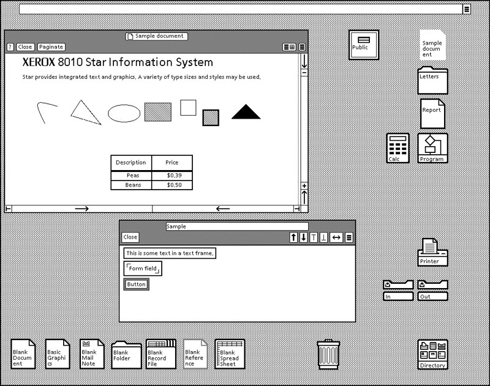

^
Trygve Reenskaug
Developing the first GUI, PARC User interface.
First, I want to take you back to the year 1979 to an office park located about 30 miles south from here. In that year a danish computer scientiest called Trygve Reenskaug visited Xerox PARC. Back then Xerox was developing the first commercially available GUI framework, you can see what it looked like on this slide. During that visit Trygve introduced the MVC pattern into Smalltalk - defining the direction for the next 35 years of UI programming.

"The top level goal was to support the user's mental model of the relevant information space and to enable the user to inspect and edit this information." Trygve Reenskaug
Trygve did not set out to invent the software architecture of the 21st century; his goal was to solve a novel problem at hand with a pragmatic solution - and he came up with a great solution for that time. He surely never anticipated the huge adoption of the pattern. In some ways he might feel like the inventor of the Keurig coffee capsules who now in retrospect regrets his invention ;)
The essential purpose of MVC is to bridge the gap between the human user's mental model and the digital model that exists in the computer.

---

##Does anyone even understand MVC?

---

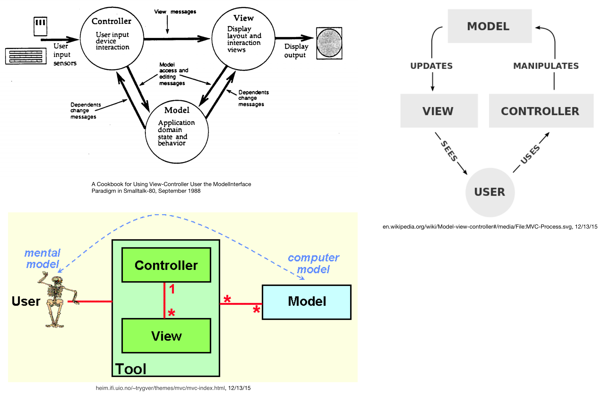

^
- We will discuss the idea of unidirectional data flow in depth later, but it is interesing to see that MVC originally set out to be unidirectional, as shown in this diagram
- The meaning of the individual components can change over time and within different contexts. Trygve uses a scrollbar as an example - a scrollbar would fullfil all 3 MVC roles by itself

---

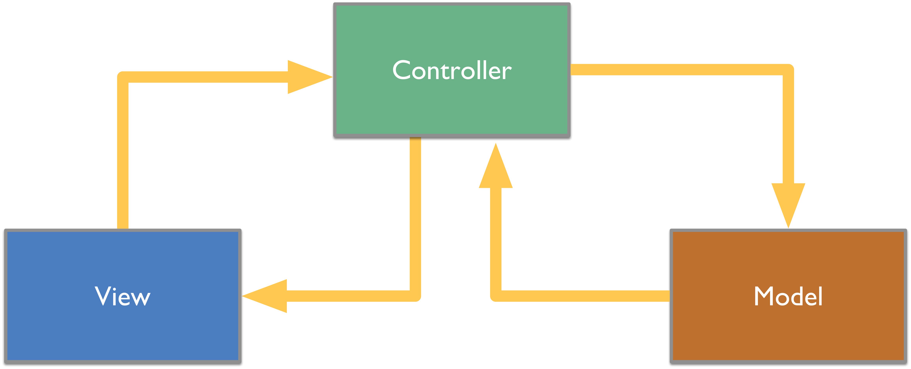

---

#2016

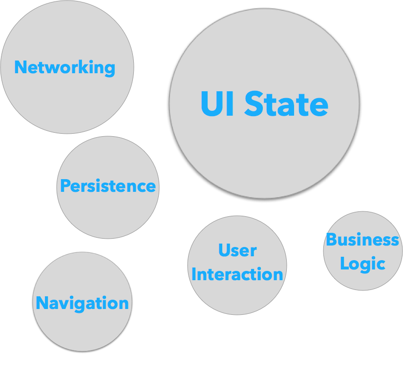

---

##MVC is an (outdated) design pattern - not an application architecture

^
- Old doesn't necessary mean bad; so I want to give a short example of the shortcomings of MVC

---

##Problem #1: View Controllers are micromanagers

####Image Credits: nakedpastor.com

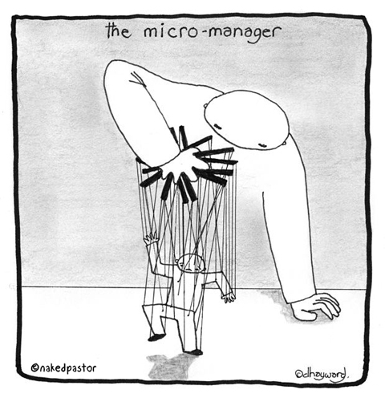

^
- ...that want to know about everything going on
- By design, Controllers need to know about everything! 

---

```swift
    func userLoggedInWithUsername(username: String, password: String) {
		apiClient.authenticateUser(username, password: password) { response, error in
			if (error == nil) {
				let nextViewController = ...
				navigationController.pushViewController(nextViewController)
			} else {
				showErrorMessage(error)
			}
		}
    }
```
    
^
- This about as good as it gets, you can hide implementation details but the view controller has to know many API details; error handling, etc.
- UIKit also encourages you to have one ViewController per *scene*, so if there's a lot of business logic on a single screen you can't avoid your controller code to grow unwieldly

---

##Problem #2: Where is state?

^
- If you become good at moving code out of VC's you have somewhat solved the first issue and you at least won't end up with VCs with multiple thousands lines of code
- However, there is a second big issue not covered in MVC: state management
- By state management I mean handling information such as: which user from a user list is currently selected? which drawing tool is selected?
- Such information can be relevant across multiple view controllers; but within MVC we don't have defined way of sharing this information

---

#Where is state?

- Currently Active Views
- Currently Active View Controllers
- Database
- Singletons?

^ 
- Active View & View Controller for storing state are fine; but only useful for the current scene
- Not everything belongs in to a database
- Singletons are shared mutable state, which often ends in sad code

---

##How do I pass information between View Controllers?

---

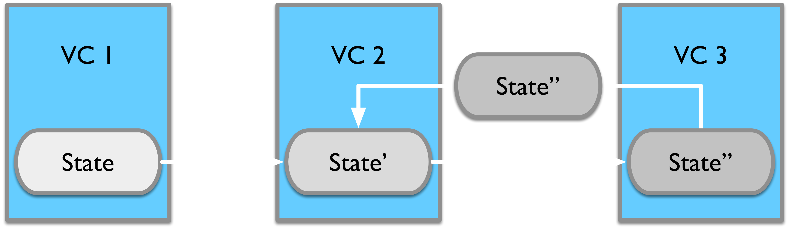

---

#Problems I have with MVC

- View Controllers need to know business logic details

^
Beyond knowing which endpoints to call, we also need to know if they are synchronous or async, we potentially need to chain different operations together, we need to handle errors...

---

#Problems I have with MVC

- View Controllers need to know business logic details
- View Controllers need to manage significant amount of state (almost anything that is not stored in the DB)

^
I would argue that a majority of iOS applications code deals with UI state a majority of the time. With MVC this code is stuck within a monolithic controller.

---

#Problems I have with MVC

- View Controllers need to know business logic details
- View Controllers need to manage significant amount of state (almost anything that is not stored in the DB)
- State management & propagation happens ad-hoc

^
We call delegates, we call callbacks, we fire notifications; depending on the weather

---

#Problems I have with MVC

- View Controllers need to know business logic details
- View Controllers need to manage significant amount of state (almost anything that is not stored in the DB)
- State management & propagation happens ad-hoc
- Very difficult to build a mental model of how an application works

^
If I want to dive into a web app, I take a look at the API and routes, they give me high level overview of the functionality and I`ll quickly know where to look for implementation details.
What's the equivalent in an iOS app? View Controllers?

---

#Meet Redux!

^
Redux is a varation of the Flux framework developed at Facebook. At its core it has the premise of a uni-directional data flow.

---

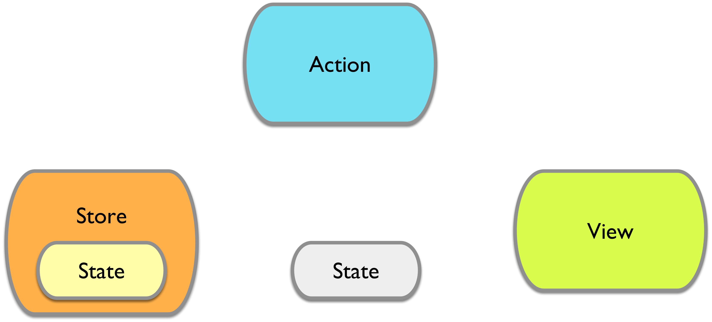

^
Here is the high level overview - we will see more detailed components in a second. The most imporant aspects of this architecture: 1. The application state has a specific shape it is a data structure that describes the *entire* application state. This state lives in what we call the store. Whenever the state changes, all subsribers will receive the latest version of the state. In most cases subscribers will be views. 2. Views react to state changes; they take in the latest state and adapt their presentation accordingly 3. State can only ever be mutated by dispatching actions to the store. An action is a description of a state change that you want to cause.
This approach has several advantages. Very importantly we have a clear separation of concerns. The store handles the business logic by taking in actions and changing the state accordingly. The view takes care of triggering actions upon user input and chaning its appereance when it receives a state update.
This was a high level overview; let's take a look at what the architecture looks like in detail.
Another detail I added in this diagram is the concept of an observer, in the bottom right, that isn't a view. You could have other components that listen and react to state updates, e.g. an Analytics component that logs analytics mesasge upon certain events.

---

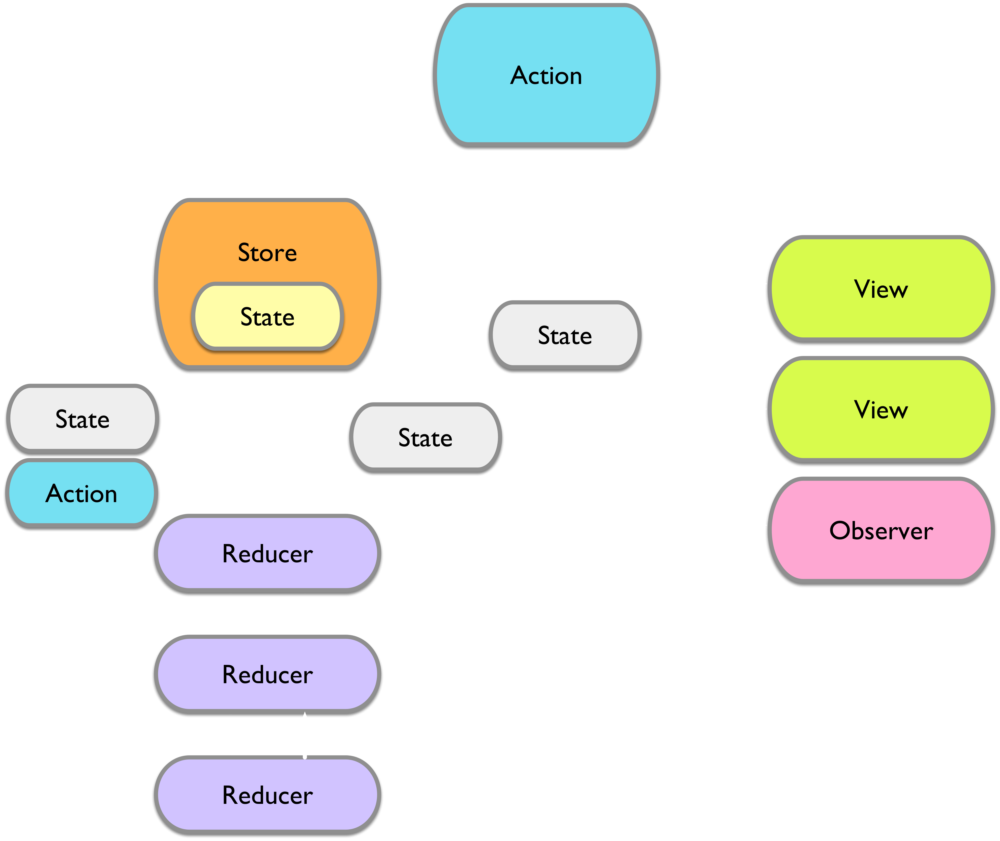

^
This here is the full architecture diagram; it adds the concepts of *Reducers*. Reducers are the components that implement state changes. When a store receives an action it forwards it to all reducers; the reducers receive the current application state and the action and can return a new applicaiton state. 
In complex applications you will have a whole set of different reducers; each reducer will take care of a specific slice of the application state; that's how you break up your business logic when using this architecture.

---

####Reducers:

-

## (State, Action) -> State

---

####Actions:

##Declarative description of a state change

---

##Swift Flow

####(Soon to be Open Source) Redux implementation in Swift

---

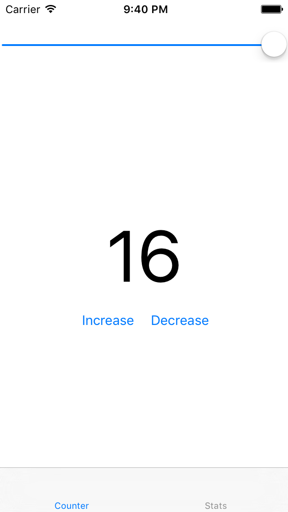

---

```swift
struct AppState: StateType, HasNavigationState {
    var counter: Int = 0
    var navigationState = NavigationState()
}
```

^
- Your state has an app specific shape; it can consist of multiple *substates*
- In this extremely simple application we have a counter variable as part of our state, along with a navigation state that is provided by a router component that is part of the framework I'm building

---
```swift
    func newState(state: AppState) {
        counterLabel.text = "\(state.counter)"
    }

    @IBAction func increaseButtonTapped(sender: UIButton) {
        mainStore.dispatch(
            Action(CounterActionIncrease)
        )
    }

    @IBAction func decreaseButtonTapped(sender: UIButton) {
        mainStore.dispatch(
            Action(CounterActionDecrease)
        )
    }
```
^
- Here's what using the framework looks like from the call-side; I've ommited the code for subscribing and unsubscribing from the store which is a line each and usually should be tied to the lifecycle of the view controller

---

```swift
struct CounterReducer: Reducer {

    func handleAction(state: AppState, action: Action) -> AppState {
        var state = state
        
        switch action.type {
        case CounterActionIncrease:
            state.counter += 1
        case CounterActionDecrease:
            state.counter -= 1
        default:
            break
        }

        return state
    }

}
```

^
- Here's the simplest case of what a reducer can look like. The actions in this simple example don't have any payloads; in your real applications they most likely will.

---

# Time Travel!

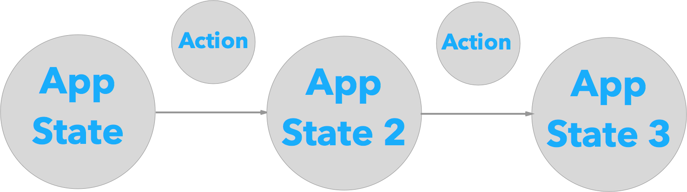

---

#DEMO

---

# Real world examples?	

^ 
- we have looked at a trivial app; does this stuff even work for *real* apps?

---

##Entire App State in ONE Data Structure?

---

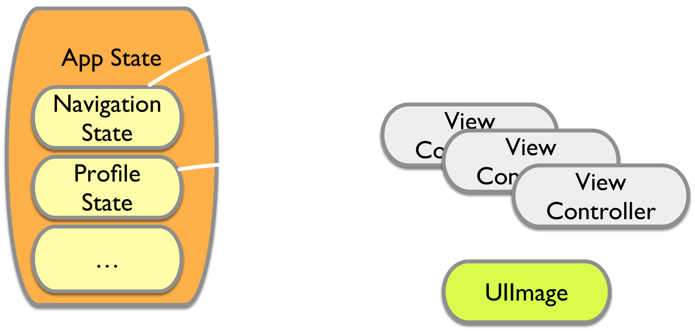

---

## What about async?

---

```swift
    func fetchUserList -> ActionCreator {
        return { state, store in
            self.apiClient.fetchUsers() { users in
                store.dispatch( SetUsers(users) )
            }
        }
    }
```

---


---

#Challenges

- UIKit
- Encoding / Decoding
- Restricing Access to Global State

---

#Why Swift Flow?

- Separation of concerns
- Decoupling of intent and implementation
- Clear, Declarative API
- Predictable, explicit state
- Program has a shape
- Automatic state propagation

^
- An action captures an intent; an intent can be implemented in many different ways and might involve different parts of your application logic over time. E.g. deleting a record might today mean simply deleting it from a database - next year you need to add an analytics call. In MVC you need to revisit you business logic or view controller and clutter them with analytics calls; with Swift Flow you can respond to the same action in multiple reducers/subscribers - you can compose functionality on top of actions without the individual parts needing to know about each other	
- OUR PROGRAM NOW HAS A SHAPE
- More Constraints!
- Declarative Programming & Composition
Constraints are a good thing. As soon as you work on a team, you start establishing and enforcing them. Typically you do that "on paper", you have a Wiki of some sorts that documents coding guidelines. Constrains on paper are much less useful than constraints in code; they outdate, they cannot be automatically enforced and they cannot be safely assumed to be adhered to at compile time. 
The more constraints you have established in code, the more safe assumptions the system can make about your application -> this allows the framework to provide features such as time travel that would otherwise need to be implemented on an app by app basis.

---

#Credits

Gerald, Redux, Jake

---

#Resources

https://heim.ifi.uio.no/~trygver/2003/javazone-jaoo/MVC_pattern.pdf

---

#View Controllers = Integration of Concerns
---

#Why do we end up with massive view controllers?

---

#To date we don't have an application architecture framework for iOS

---
 
#Where is state?


---

I've lost count of the times I've seen something described as MVC which turned out to be nothing like it. Frankly a lot of the reason for this is that parts of classic MVC don't really make sense for rich clients these days.

---

View Logic: 

 - (State) -> View
 - () -> Action

Application Logic: 

 - (Action, State) -> State
 - (State) -> Action

---